# 12 · The same wall (opened Jul 9 · **primary run VALID, central contrast held; holdout: token core confirmed, the blade not world-portable — confirmation withheld; next wall named**)

**Question.** The epistemology dialogue (`epistemiology_opus_talk`, Jul 9)
closed on one load-bearing wall:

> *How do you tell that two independent paths arrived at THE SAME dead end,
> and not at two neighboring ones?*

Everything above it stands on this detector. The dialogue's summit —
**invariance across independent paths separates a wall of the world from a
wall of the language** — is a triangulation procedure, and triangulation
stands on identity-of-place. If the identity detector lies, two correlated
trajectories sharing one blindness produce a **false world-invariant**: a
confident, low-variance, wrong intersection (Fable review, seed 3). The
original engineering question of the line — *how does a model earn
experience in pure algebra and geometry?* — reduces, per the dialogue's core,
to: one task, many independent languages, a ledger of what survives the
change of derivation route. That ledger has exactly one unproven load-bearing
component. This one.

**Status.** Open. Analytical base audited ready on Jul 9 (dialogue core +
Codex review + Fable reviews); the remaining open questions are
instrument-level and resolvable only computationally. Phase 0 (scouts, not
citable) is running. One designed fall has already been taken and paid out:
surface compression (zlib-NCD over journals) **fails as an independence
measure** — it tracks journal volume, not algorithmic dependence, and its
dependent/independent bands converge as the world grows (the B2.3 lesson —
"more data made things worse" — reproduced on our own instrument at first
contact). No prereg is locked around a broken instrument: phase 0 must
deliver a measure that survives its own sham ladder first.

```mermaid
flowchart TD
    classDef verified fill:#1a7f37,color:#fff
    classDef falsified fill:#8b1a1a,color:#fff
    classDef open fill:#4a4a4a,color:#eee
    classDef concl fill:#b8860b,color:#fff

    D["Dialogue: invariance across independent<br/>paths separates world-wall from language-wall"] --> Q
    Q["12 · The same wall: the identity-of-place<br/>detector under triangulation"]:::open
    Q --> S0["Scout (pre-line, not citable): zlib-NCD<br/>over journals confounds volume with<br/>dependence; bands converge with n"]:::falsified
    Q --> P0["Phase 0: instrument forge —<br/>competent third language; predictive<br/>independence measure; sham ladder"]:::open
    P0 --> S3["Scout 03 (Codex gate): clone caught, ordering<br/>held, BUT sham-a killed the v0 null — stratum-level<br/>marginals read world-parameter common cause as<br/>language dependence; mode-split channel untested"]:::falsified
    S3 --> V1["v1 (amended by Codex): no path WITHOUT A<br/>COUNTERFACTUAL PROFILE enters triangulation —<br/>RNG jitter and world-perturbation ensembles are<br/>two implementations of one admission requirement"]:::open
    V1 --> S4["Scout 04: clone caught seed-invariantly;<br/>seed-sham correctly read as schedule-dependence;<br/>(A,G) reads construction-dependent — the detector<br/>refuses to credit Cayley agreement to the world"]:::verified
    V1 --> S4f["Scout 04 falls: attractor verdict was an artifact —<br/>seed-block pseudo-replication (eff. n = K, not cells;<br/>Fable seed 3 in our own harness) + admission must<br/>require WORLD-SENSITIVE profiles"]:::falsified
    S4f --> S5["Scout 05 (v2): instance-level significance +<br/>admission gate. Clone ✓, seed-sham ✓, independents ✓;<br/>masked-postulate sham invisible on its home stratum<br/>EXACTLY as preregistered (wobble exc = 0.000) — the<br/>instrument sees interface-dependence, not<br/>postulate-dependence: W→I→L measured on the<br/>instrument itself; its token language hit its own<br/>sev_L → 0 (mode-split channel owed to scout 06)"]:::verified
    S5 --> S6["Scout 06 (M6, three recorded iterations): schedule<br/>CO-ADAPTATION — the journal channel. The coin-masked<br/>postulate, invisible to every token channel, IS visible<br/>in probe-schedule geometry (0.60/0.67); cosmetic pair<br/>separated at 0.000; the S2 limit was the token
language's,<br/>not triangulation's — π pierces it"]:::verified
    S6 --> S7g["Scout 07: field-relative calibration — independents<br/>deeply negative, cosmetic 0, postulate pair flagged;<br/>BUT the preregistered contamination limit FIRED:<br/>cluster-heavy pool inflates the median field, the clone<br/>under-flags. Pool diversity is now a MEASURED<br/>precondition; the field statistic goes to Codex<br/>before any lock (post-hoc tuning = Goodhart)"]:::falsified
    S7g --> S8["Scout 08: Codex's own repair (component collapse +<br/>external q75) fell on BOTH his attacks — edge threshold<br/>sits below the world-floor, all world-responsive languages<br/>fuse into one component; external pairs measure the<br/>no-response floor, not the world-floor → UNKNOWNs and<br/>false flags. THE RECURSION: the field needs the very<br/>independence the instrument detects"]:::falsified
    S8 --> S9g["exit named by the line's own core: independence of<br/>the null-pool cannot be certified from inside — it must be<br/>CONSTRUCTED: preregistered reference constructions,<br/>disjointness as a declared assumption (the forge's<br/>five-minds architecture, derived as necessity)"]:::open
    S9g --> S9["Scout 09: reference field {A,P,W,M} — clone, postulate<br/>AND coin-masked flagged in ALL pools; independents clean;<br/>field structurally immune to both contamination attacks<br/>(0.40–0.41 in every pool). First full ladder pass.<br/>Lesson: admission is PER CHANNEL (a journal-blind pair<br/>belongs to the token channel)"]:::verified
    S9 --> S10["Scout 10: Codex's per-stratum reference gate REJECTED<br/>as specified — defect strata force world-driven lockstep on<br/>honest references too (wobble q75 = 1.000); differential<br/>version reintroduces the recursion. Poisoned-normalizer<br/>bite on the GLOBAL field measured: +0.044. Prefix-hygiene<br/>gate separates by construction (honest max 1, poisoned min 3)"]:::falsified
    S10 --> PREREG["Experiment A prereg: DRAFT v2 —<br/>Codex UNKNOWN semantics + outcome table adopted"]:::open
    PREREG --> REV["Two-review triangulation (Opus 4.8 + GPT 5.5,<br/>independent): C7 missing — no positive control for TRUE<br/>convergence; destination/dependence/truth conflated;<br/>'Cayley glue = dependence' was an ASSIGNED label —<br/>v2 NOT signed; core amendments accepted (π example,<br/>invariance analogy, bounded insight triggers,<br/>robustness not reality)"]:::falsified
    REV --> RD["Redesign: two A/G genealogies (translated vs<br/>independent-build under provenance protocol) —<br/>the founding question made measurable; two-axis<br/>verdicts; dual-oracle truth; holdout after lock"]:::open
    RD --> CR["Clean-room build received (GPT 5.6, web, different<br/>account, zero FS): first contact exposed OUR truth-label<br/>bias (wobble extensionally None — the A-language view<br/>caught by code that could not see our worlds)"]:::verified
    CR --> S11["Scout 11: THE GENEALOGIES ARE DISTINGUISHED —<br/>(A,Gt) derived: DEP(token) 0.053, seed-invariant;<br/>(A,main) clean-room: CLEAN with 9 same correct<br/>destinations — true convergence NOT written off as glue<br/>(C7 live, passed). E3 fell: shared-helper pair read CLEAN —<br/>COMPETENCE MASKS DEPENDENCE: channels see dependence<br/>only through errors; stress strata owed to scout 12"]:::verified
    S11 --> S12["Scout 12 (stress): H-THEOREM — shared thresholds<br/>without shared randomness decorrelate even under stress;<br/>only CORRELATED falls testify. Plus the VISIBILITY WINDOW:<br/>(A,Gt) flags at 0.160 on deterministic traps, decoheres at<br/>high noise. Trap attractor absorbed by the null (E3 ✓).<br/>Phase 0 closed — PREREG v3 next"]:::verified
    S12 --> V3R["PREREG v3 → second two-review attack: FORMAL BUG<br/>(C2 pairs are reference units — leave-family-out leaves<br/>1 < 3 pairs: INCONCLUSIVE guaranteed by design) +<br/>K2b unidentifiable (N-version common causes: task,<br/>budget, spec encoding, model prior — Eckhardt–Lee) +<br/>journal channel conflates competence-convergence with<br/>genealogy-convergence. v3 NOT signed"]:::falsified
    V3R --> V4["v4 plan: success/failure split (co-adaptation surviving<br/>into correlated failure = ancestry; success-only = the<br/>world's one door — the first rock, operationalized);<br/>C8 common-prior ladder; reference bank ≥ 5–6 external;<br/>E/D/N/P outcome axes; OC tune/validate; blind sanity;<br/>holdout escrow BEFORE the run"]:::open
    V41 --> RUN["PRIMARY RUN (Jul 11, harness-VALID decision):<br/>EXPA-NOT-CLEAN, THE CENTRAL CONTRAST HELD —<br/>K2a: derived DEPENDENT; K2b: clean-room CLEAN with<br/>destinations 8/8; K1 8/8+8/8; K3, C1, C2, C_PM green.<br/>C_C8 red: the common-prior control below the locked<br/>margins (token 0.034; journal 0.565 < field 0.672 on the<br/>registered quorum edge) — published as-is. Three signed<br/>amendments en route, each forced by execution, each a<br/>measurement. Remaining: tagged release → key → holdout"]:::verified
    RUN --> HOLD["HOLDOUT (escrowed pre-primary, hash-verified,<br/>published regardless): H1 fwd-derived ✓, H2 reverse == H1 ✓,<br/>H3 same-prior ✓, H5 replication ✓ (token 0.141);<br/>H4 cross-prior FLAGGED via journal alone — J 0.857 EQUALS<br/>the true derived pair's J while values read 0/24 and token 0.0:<br/>on fresh fail-classes the world has ONE DOOR for adaptive<br/>scanners and the blade reads it as ancestry. Review X's<br/>competence-convergence objection, invisible to dev-family OC,<br/>exposed by escrow. CONFIRMATION WITHHELD as preregistered.<br/>The token channel is the portable core; world-portable<br/>journal calibration = the next wall"]:::falsified
    V4 --> C8F["C8 first contact: THE COMMON-PRIOR CELL FIRES 24/24 —<br/>A (Fable) and opus-A (clean room, Anthropic sibling) agree<br/>on the wrong value in every case; A vs gpt-A: 0/24.<br/>Clone-by-convergent-design at zero communication:<br/>the clean room does not produce independence when priors<br/>are shared. Five minds = measurable independence<br/>engineering, family diversity carries it"]:::verified
    C8F --> S13["Scout 13: the blade validated — ALL SEVEN prereg
expectations held (first all-green scout). Clone/derived/<br/>common-prior → ANCESTRY (J_fail 0.60/0.53/0.50);<br/>independent/perf-matched/shared-helpers → NO_SIGNAL;<br/>clone co-adaptation lives ONLY in failure (J_succ = 0.00):<br/>'only falls testify' confirmed by the validity gate itself.<br/>Formal bug closed by 6-unit bank (E7). Thin margins →<br/>OC resolution study next"]:::verified
    S13 --> S14["Scout 14 (OC-tune): THE WINDOW IS EMPTY — the
simplified rule has no operating characteristics. Three<br/>diagnoses: QUIET-FAILER HOLE (clones of AB/TO-failing,<br/>static-schedule bases invisible → applicability domain =<br/>value-failing adaptive languages, becomes an admission<br/>axis); blade WITHOUT the field has no specificity (wobble<br/>FPR 0.64); PM pseudo-replication via pert-invariant seeds<br/>(scout-04's lesson, third arrival). OC must run the FULL<br/>pipeline — the simplification itself was the failure"]:::falsified
    S14 --> S15["Scout 15 (OC-tune-2, full pipeline): PM fixed;
field kills the wobble FPR; TWO refinements paid:<br/>the admission axis is SCHEDULE-ADAPTIVITY (W/M clones<br/>are informative yet invisible — deterministic schedules +<br/>point-mass absorption + stream misalignment); the field<br/>must be ADAPTIVITY-MATCHED to candidates (static references<br/>under-floor adaptive pairs → one FP). Window empty at<br/>scout n as the prereg allowed: the locked OC is a matter<br/>of SCALE (10–20×), not of new knobs"]:::open
    S15 --> S16["Scout 16 (OC at scale) + Grok/Gemini: derived 4/4<br/>on adaptive bases; the 'FPR' dissolves — same-author pairs<br/>are NOT certified independent (A/W/M/P share one author);<br/>certified cross-prior pairs clean 3/3. THE GRADIENT 24/12/0:<br/>coupling follows the converged probe CHANNEL + validation<br/>discipline, not family or declared mechanism — gemini's<br/>'linear scanner' decouples 0/24, grok's 'birthday'<br/>half-couples 12/24. Six families, four priors:<br/>the certified cross-prior bank exists"]:::verified
    S16 --> V41["PREREG v4.1: review series CONVERGED — round 3 (W, Z)
signable under a finite list, all integrated. Z's real<br/>contradiction: the field's selection axis (adaptivity)<br/>correlated with the signal's mechanism (convergence) →<br/>leave-CONVERGENCE-out. C8 never rescues K2b. Escrow v2:<br/>named provider as prediction, plaintext isolation, commit<br/>DAG. Z's closing: cracks migrate UP levels at decreasing<br/>cost — a converging series; the wall of the world.<br/>AWAITING: author signature → OC runs → escrow → lock"]:::open
    P0 --> EA["Experiment A (designed fall): in Z/nZ the<br/>algebra↔geometry agreement is a THEOREM<br/>(Cayley) — the destination-detector must fire<br/>'world wall' on a built-in false coincidence"]:::open
    EA --> EB["Experiment B: can a journal/intervention<br/>detector separate isomorphic agreement from<br/>independent agreement? (kill threshold preregistered)"]:::open
```

## The world, the task, the languages

Chosen for minimality and external truth (Codex review, adopted):

- **World.** `Z/nZ` with anonymous states, one generator `R`, `L = R⁻¹`.
  Truth is fully known outside (`u(x₀)=v(x₀) ⇔ net(u) ≡ net(v) mod n`) and
  fully hidden inside.
- **Task (extensional, no ontology smuggled).** Given a bounded budget of
  oracle queries "do these two words land on the same state?", predict
  equality for unseen word pairs.
- **Interface `I`.** The equality oracle, shared by all languages. Held fixed
  in phase 0/A and *named honestly*: invariance across languages at fixed `I`
  is invariance-of-language-at-this-channel, never yet a fact of the world
  (the `W → I → L` split; the interface is itself a later sham target).
- **Languages** as quadruples `(P, C, S, K)` — primitives, composition,
  search moves, description cost. Language A (algebra: minimal relation
  `Rᵐ = e`), language G (geometry: fundamental cycle of the state graph),
  language P (probabilistic/coding; must be made *competent* — see scout
  lessons). A path is a **journal** `π = (h₀, q₁, o₁, h₁, …)`; a reper is a
  prediction error; a dead end is `sev_L → 0` (nothing in L compresses
  further).

## The built-in gift: Cayley as a free sham

In this world algebra and geometry are glued by the Cayley graph: `Rⁿ = e`
and "the cycle has length n" are one number under an isomorphism. Their
agreement is a **theorem, not evidence**. So the cheapest kill comes first
and is designed before any positive claim:

> **Experiment A (preregistered fall).** A naive detector that reads
> *destinations* ("both languages report m ⇒ world wall at m") MUST be
> fooled by the isomorphic pair. If we cannot build a detector that
> abstains here, everything downstream is uncitable — agreeing languages
> would crown the algebra↔geometry dictionary as an empirical discovery
> (the `information_ratio = 0.047` class of error, at line scale).

The deeper stake, from the recovered dialogue tail: *found vs made* becomes
two instruments. The **destination detector is the platonist** (structure
sits in the object; read the result). The **journal detector is the
constructivist** (structure is the performed assembly; read the trajectory).
Phase A/B runs them against each other.

## The sham ladder (rule 3: every filter gets its null arm)

Three kinds of false coincidence, all constructible here because truth is
external (Codex review, adopted as the line's spine):

1. **Shared interface** — both languages see through the same slit; their
   agreement is the channel's, not the world's.
2. **Shared postulate** — implanted common blindness: two surface-different
   languages carrying one hidden shared assumption (in `Z/nZ` the A↔G
   isomorphism stands as this sham for free; a decorated-clone language —
   same effective channel under cosmetic renaming/noise — is the adversarial
   version the instrument must also catch).
3. **Neighboring dead ends** — `Z/nZ` vs `Z/mZ`, m near n: distinct walls
   the detector must NOT merge.

Kill discipline: the identity detector is only trusted after it (a) abstains
on implanted coincidences, (b) separates neighbors, (c) still fires on the
genuine article. Thresholds go into `PREREG.json` before the citable run;
scouts may fall freely before the lock, and their falls are recorded.

## Phase 0 — instrument forge (running)

1. **Competent third language.** Scout lesson: the first probabilistic
   language (gcd over random returns) failed to reach the wall for `n ≥ 12` —
   an incompetent independent language confounds *incompetence* with
   *independence*. The independent route must actually arrive.
2. **Predictive independence measure.** Replace surface compression with
   reper-prediction: path B is dependent on path A iff knowing B's journal
   predicts *where A gets surprised* cheaper than A's own entropy. Decomposed
   over questions (probe policy) and answers (oracle bits), because in a
   world pinned by any competent journal, answer-prediction saturates
   trivially — the signal, if any, lives in the surprise structure.
3. **Sham ladder v0** — the three false coincidences above, built and thrown
   at the measure before any prereg lock.

**Scout 03 (Codex adversarial gate, Jul 10 — instrument v0 fell, twice
informative).** Codex (GPT 5.5, relayed) specified: failure tokens
(SUCCESS/ABSTAIN/WRONG_CONFIDENT/WRONG_DEGRADED/TIMEOUT), a marginal-null
arm with Monte Carlo resampling, metrics M1–M4 with a fixed verdict rule,
and two sham pairs — (a) independent languages sharing a small hypothesis
grid (error attractor), (b) one shared blind postulate with split surface
modes (lie-with-value vs abstain). Preregistered outcomes: clone caught
(M1 excess 0.267, p=.001), ordering clone > isomorph > independent held
(0.267 > 0.192 > 0.000), independents clean. **Both prediction errors are
the payout:** sham-(a) was NOT explained away — stratum-pooled nulls read
world-parameter common cause as language dependence (the Codex
"world-difficulty" confound returning through the remedy for point-mass
marginals); sham-(b) was caught, but by the M1 value channel, so the
mode-split channel (M3/M4) remains untested-positive, not confirmed. The
measured dilemma: per-instance nulls blind the detector to deterministic
clones; per-stratum nulls hallucinate dependence through the world. **v1
hypothesis (line-level candidate theorem): no deterministic path enters
triangulation** — every language must carry internal randomness so that
per-instance nulls become identifiable; then instance-level coupling
beyond the null = shared construction, stratum-level coupling = shared
world. Artifacts: `experiments/12_same_wall/scouts/scout_03_codex_gate.py`.

**Scout 04 (v1: counterfactual profiles, Jul 10 — core survived, two new
falls, both paid).** Codex's second review amended the v1 hypothesis before
the build: stochastization is a property of the *instrument*, not of
triangulation — a deterministic path gets its "how else would you have
climbed" bundle from a fixed, truth-preserving ensemble of world
perturbations (basepoint shift, generator reversal, budget ±, noise
reseed). Admission requirement restated: **no path without a counterfactual
profile enters triangulation.** Scout 04 built the two-floor design:
per-instance pooled nulls + a seed-decorrelation control (construction
dependence must survive crossing the languages' internal seeds).
Outcomes: clone caught seed-invariantly (E1, and with it E6 — deterministic
paths admitted via perturbation profiles); the deliberate shared-scheduler
pair correctly downgraded to CONTACT_SCHEDULE_DEPENDENT (E3); independents
clean (E5); and (A,G) reads CONSTRUCTION_DEPENDENT — the detector refuses
to credit the Cayley pair's agreement to the world, which is precisely the
abstention Experiment A requires (thin margin over the clone, 0.087 vs
0.095 — not to be over-read before the null is fixed). The falls: (1) the
attractor pair's verdict was an artifact of **seed-block
pseudo-replication** — with world-insensitive languages every cell repeats
the same K=3 seed pairs, effective sample size is K, and the cell-level
null hallucinates significance (Fable seed 3 — effective sample size under
dependent evidence — arriving inside our own harness); remedy: the null
must resample at the seed-block level, K ≥ 8. (2) The admission criterion
completes: the counterfactual profile must be **world-sensitive** — a
language whose profile answers only its own dice never touched the world
and cannot testify about walls; the attractor pair is not "falsely
dependent" but inadmissible. Deferred and still owed: Codex shams S2
(stochastically masked shared blindness) and GatedLollipop mode-split.
Artifacts: `experiments/12_same_wall/scouts/scout_04_v1_counterfactual.py`.

**Scout 05 (v2: block significance + admission gate + S2, Jul 10 — ladder
survived; one limit measured exactly as preregistered).** Fixes: instance-
level dispersion replaces cell counts (K=8; analytic per-instance null);
admission requires world-sensitive counterfactual profiles. Sham S2 built
as WobbleCycle (R-channel an honest n-cycle, L-channel sticky — NOT R⁻¹):
languages N and C share the latent postulate "L is R's inverse", pick
channels by independent coins, N lies with a value where C abstains.
Outcomes: clone caught (0.093±0.013, seed-invariant); seed-sham correctly
downgraded (0.291 matched → −0.108 crossed); independents clean (0.044,
noted: close to the 0.05 bar); Lp excluded by the gate but Lr admitted at
sens 0.338 vs the 0.30 bar — the scalar threshold is fragile at the
boundary and needs a principled form before any prereg. Two central
results: (1) **E6 confirmed exactly**: on its home stratum the constructed
shared postulate is invisible (wobble excess = 0.000) while the pair still
reads CONSTRUCTION_DEPENDENT through alias/noisy — the instrument sees
*interface*-dependence and is blind to *postulate*-dependence: the W→I→L
stratification measured on the instrument itself. M1's token language
cannot express WC↔AB coupling — the detector hit its own sev_L → 0; the
mode-split channel (fixed mode_rank, Codex spec) is scout 06's target.
(2) The clone and the Cayley pair TIED (0.093 vs 0.094): both are refused
world-credit — the abstention Experiment A requires — but the instrument
does not yet separate "same effective channel" from "theorem-glued
different channels"; that separation belongs to the interface arm
(varying I), not to richer tokens. Artifacts:
`experiments/12_same_wall/scouts/scout_05_v2_blocks_admission.py`.

**Scout 06 (M6: schedule co-adaptation — the journal channel; Jul 10;
three iterations, all recorded in the file).** Designing Codex's mode-split
world exposed a head-on collision between his own S1 rule ("dies under
seed-crossing ⇒ contact schedule, not path") and the S2 goal: a
postulate-sharing pair's probe schedule IS its postulate, and also dies
under crossing. Resolution: cosmetic schedules are STATIC across world
perturbations; postulate-driven schedules CO-ADAPT. So the channel reads
journals — the line's founding move (read π, not h_t) arriving inside the
instrument. Metric M6: correlate two languages' schedule-shift fingerprints
across perturbation pairs (matched and crossed seeds). Iteration falls,
each diagnosed in-file: (i) logging probes post-rev injected the world's
response into every fingerprint; (ii) residualizing against a clustered
language pool manufactured spurious ±correlations; (iii) budget
perturbations are a parameter of the LANGUAGE's contact, not the world —
including them let the cosmetic pair survive crossing (W→I→L, a third
time, now inside the perturbation ensemble). Final state: **the
coin-masked postulate pair (N,C), invisible to every token channel
(scout 05: exactly 0 on its home stratum), is VISIBLE in probe-schedule
geometry (0.60 matched / 0.67 crossed)** — the S2 limit belonged to the
token language, not to triangulation; the journal pierces it. Cosmetic
pair separated at 0.000; clone and postulate pairs 0.62–0.75. Open, owed
to scout 07: the absolute threshold is dead — independent pairs sit on a
world-floor ≈ 0.47 (even P's emission adapts to the world through
short-circuit confirmation probes); the verdict must be calibrated
floor-relative, not against a constant. Artifacts:
`experiments/12_same_wall/scouts/scout_06_schedule_coadaptation.py`.

**Scout 07 (field-relative calibration, Jul 10 — the preregistered
contamination limit fired, measured).** The null without chicken-and-egg:
the field itself — flag a pair only if its co-adaptation exceeds the
median co-adaptation of each partner with the rest of the pool (margin
0.10, matched AND crossed). Clean results: independents deeply negative
(−0.13…−0.18), cosmetic at 0, the postulate pair flagged through
contamination (0.154/0.130). The fall, exactly where preregistered: our
pool is deliberately cluster-heavy, the scan family (A, A', G, N2, C2)
inflates its own members' fields to ≈ 0.66, and the CLONE under-flags
(crossed excess 0.064 < margin) — "a thousand walkers with one brain is
one walker" now stands as a *measured* precondition of the instrument:
the field-null requires pool diversity. The open knob is the field
statistic (median vs lower-quantile vs min-k); choosing it post-hoc on
the same data would be Goodhart — the choice goes to Codex adversarially
before any prereg lock. Artifacts:
`experiments/12_same_wall/scouts/scout_07_field_calibration.py`.

**Scout 08 (the Codex repair under its own attacks, Jul 10 — double kill,
and the recursion surfaced).** Codex specified: cluster the pool (edge iff
crossed co-adaptation ≥ 0.30, significant), calibrate each pair only
against EXTERNAL component pairs, field = max(0, q75), UNKNOWN if < 3
external pairs — with under-flag (70% one-cluster pool) and over-flag
(anti-correlated decoys) shams and explicit kill conditions. Both kills
fired. (1) The edge threshold 0.30 sits BELOW the measured world-floor
≈ 0.45, so ALL world-responsive languages — including honest P — fuse
into one component; only static/no-response languages remain external;
everything returns UNKNOWN. (2) With decoys added, the external
components are precisely the non-world-responsive ones, whose J ≈ 0 is
the no-response floor, not the world-floor: field = 0 and honest
independents (0.47) false-flag. Diagnosis, one level up: **the field
needs pairs that share the world but not construction — and telling
those apart is the instrument's own task. The recursion is real: tokens
needed a floor → journals; journals needed a floor → the field; the
field needs clusters; the clusters need a floor.** The exit is named by
the line's own core: independence cannot be certified from inside — it
must be constructed. The null-pool's diversity is an engineering INPUT:
preregistered reference constructions whose disjointness is a declared
assumption of the design, not a measured fact (the forge's five-minds
architecture, derived as a necessity of the instrument; the
fallacy-cutter thesis — the harness removes virtue from the trust
chain, not skill — arriving at the field statistic). Next: scout 09,
reference-pair field. Artifacts:
`experiments/12_same_wall/scouts/scout_08_component_field.py`.

**Scout 09 (reference field — first full ladder pass, Jul 10).** Four
references declared mechanism-disjoint by construction — A (linear origin
scan), P (random pair sampler), W (adjacent-pair walker, new), M (interval
bisection, new) — field = max(0, q75) of their mutual crossed
co-adaptations, candidates excluded, <3 pairs ⇒ UNKNOWN. Results: clone
(0.72/0.62), postulate (0.75/0.71) and coin-masked (0.60/0.67) pairs
flagged against field 0.40–0.41 in ALL three pools, including the
scan-heavy under-flag pool and the decoy over-flag pool — the field reads
only reference pairs and is structurally immune to pool composition; the
declared disjointness held empirically (reference pairs 0.36–0.41, tight).
Independents clean (G,P at 0.46: excess 0.05 < margin). One preregistered
expectation fell, diagnosed: the same-family positive control (P,Pv) did
not flag because Pv, stripped of its short-circuit, lost journal
world-sensitivity entirely (zero fingerprint) — its dependence with P
lives in token values, not journals. Lesson folded into v3: **admission
is per channel**; a journal-blind pair is the token channel's case. The
instrument's scope, fixed by Codex's residual hole and adopted verbatim:
INDEPENDENT means clean under registered token and journal channels given
the declared references — never proven absence of latent shared
implementation. Artifacts:
`experiments/12_same_wall/scouts/scout_09_reference_field.py`.

**Scout 10 (the reference gate vs the poisoned references, Jul 10 — the
gate fell, the attack was bounded, the hygiene check stood).** Codex's
final attack: four references with surface-disjoint mechanisms sharing one
"harmless" preprocessor (orientation-detecting preamble that flips every
probe schedule in lockstep). His proposed per-stratum q75 gate was tested
and REJECTED as specified: on defect strata the world's response is
low-dimensional and forces lockstep on HONEST references too (honest
wobble q75 = 1.000 with no normalizer at all); a differential gate
("lockstep beyond the world's") needs independent references — the
recursion, third arrival. What the scout bought instead: (1) the poisoned
attack's practical bite on the GLOBAL field is measured — +0.044 (0.402 →
0.446), not enough to flip the clone control (excess 0.27), enough to flip
a borderline pair — so semantic shared preprocessors go into
`not_tested_against` with a number attached; (2) a cheap lockable
**prefix-hygiene gate** separates by construction: no two honest
references share an emitted probe prefix ≥ 2 on any instance (honest max
1, poisoned min 3) — catches literal shared preambles, trivially evaded
by interleaving, and is scoped as exactly that. PREREG DRAFT v2 adopts the
full Codex lock-list, UNKNOWN semantics (K2 fails on UNKNOWN; C1 UNKNOWN
= FAIL; C2 UNKNOWN ⇒ run INCONCLUSIVE), and his preregistered outcome
table verbatim. Artifacts:
`experiments/12_same_wall/scouts/scout_10_reference_gate.py`,
`experiments/12_same_wall/experiment_A/PREREG_DRAFT.md` (v2).

**The two-review triangulation (Opus 4.8 + GPT 5.5, independent,
Jul 10 — v2 NOT signed; the line's method applied to itself).** Both
reviews, arriving by different routes, hit one blocking hole: **no C7**
— no positive control for TRUE independent convergence; an instrument
that calls every convergence "glue" passes K2+C1 while blind to real
world-invariants ("conservative by construction" — the B1 tautology
class, one level up). GPT went further: the design conflates destination
agreement, path dependence, and world truth; **"Cayley glue =
dependence" was an assigned label, not a fact** (the theorem links
targets, not procedures; in Z/nZ agreement of competent order-finders is
world-forced) — so the clone≈Cayley tie (0.093/0.094) has a second live
reading: the metric may measure shared world/interface forcing, not
shared construction. Resolved empirically in the redesign: **two A/G
genealogies** — translated (registered dependent sham) vs
independent-build (C7 provenance protocol: separate code paths, RNGs,
authors; allowed common causes = W and I only) — does v3 distinguish
genealogies of the same theorem-glued destination? The founding question
of the line, made measurable. Opus's dichotomy ("C7 impossible ⇒ wall of
the world") is answered constructively: scout 09's (G,P) already read a
true convergence as clean — C7 is buildable, it was just never
registered. Also accepted: K1 downgraded to a regression arm (unit test,
not citable epistemology); K3 input signatures must be written out;
dual-oracle ground truth; 6–8 references with leave-both-out spelled
out; pre-lock operating characteristics; **holdout world family
generated only after lock** (ten scouts made this family a development
set). **Core amendments** (correcting the dialogue's core itself): the π
example is wrong as algorithmic randomness (π computable, K = O(log n));
the scout-08 recursion stands on its own measurements, NOT on the
invariance theorem (analogy, not derivation); "insight trigger
uncomputable" narrowed to "no known universal computable trigger"
(DreamCoder/AlphaGeometry falsify the strong form); "reality =
invariance" downgraded to Wimsatt-robustness conditional on competence
and bounded error dependence. Current honest label (GPT, adopted
verbatim): *v3 is a candidate detector of residual path dependence under
fixed W, I, perturbation family, and declared references* — not yet a
detector of "the same wall". Artifacts:
`experiments/12_same_wall/experiment_A/REDESIGN_AFTER_REVIEW.md`.

**Clean-room build + scout 11 (the two genealogies, Jul 10–11).** The
independent implementation arrived from GPT 5.6 (high), WEB session under
a DIFFERENT account — zero filesystem access, different model version
than the reviewers: mechanical clean room exceeding the spec. Committed
verbatim (sha256 40c2493b…) before any run. First contact paid
immediately: the received solvers bypass the origin blur that fools our
A (mixed-word contextual probes); the Cayley-translated sham decouples
from A on alias worlds (derivation-dependence ≠ failure-profile
identity); and the clean-room code exposed OUR truth-label bias — wobble
truth was the A-language view; extensionally it is None, and the
received ABSTAIN is the more correct verdict (Opus crack 3, bitten
concretely by code that could not see our worlds). Scout 11 then ran the
redesigned core: **the genealogies are distinguished.** (A, Gt) —
registered derived — flags DEP(token) at 0.053, matched = crossed;
(A, main) — registered clean-room — reads CLEAN on both channels while
agreeing on 9 correct destinations: true independent convergence is NOT
written off as glue. C7 ran live and passed; GPT's alternative reading
(the metric measures world forcing) is disconfirmed for the token
channel in this configuration — the forcing is identical across the two
pairs, the verdicts are not. Honesty notes: the (A,Gt) margin is thin
(0.053 vs 0.05); and expectation E3 FELL, opening the next wall —
**(main, ref1), sharing internal helpers, read CLEAN, because both are
competent enough to almost never err: the channels read dependence only
through errors, so COMPETENCE MASKS DEPENDENCE.** Registered
consequence: dependent-pair controls need stress strata (noise above
validation thresholds, n beyond budget) where even strong solvers err —
scout 12's target, before PREREG v3. Artifacts:
`experiments/12_same_wall/experiment_A/{received/find_order_solvers.py,
integration_first_contact.md}`,
`experiments/12_same_wall/scouts/scout_11_two_genealogies.py`.

**PREREG v3 → the second two-review attack (Jul 11 — v3 NOT signed; one
formal bug + the identifiability wall).** Review Y found a FORMAL BUG,
independently verified before acceptance: the C2 negative-control pairs
(W,P), (M,P) are themselves reference units, so leave-family-out leaves
one external pair (< 3) — UNKNOWN, hence run-level INCONCLUSIVE,
guaranteed by construction. A prereg that cannot pass its own control
survived phase 0 unseen because scouts never gated on C2 — caught only
by foreign eyes. Deeper (Y): the K2b flag is unidentifiable — the
clean-room protocol excludes artifact transfer but NOT the N-version
common causes (task, budget, output contract, spec encoding, model
prior; Eckhardt–Lee: independently built versions co-err far above
independence) — remedy: the C8 common-prior ladder (factorial: spec
encoding × builder prior × provenance) with registered diagnoses;
"instrument conservative" is never inferable without that contrast.
Review X: the journal channel CONFLATES competence-convergence with
genealogy-convergence (on deterministic strata every good solver
converges to the task's one good schedule) — remedy, and the line-level
lever: the **success/failure split** — co-adaptation that survives into
correlated failure is ancestry; co-adaptation living only in success is
the world's one door. This is "only correlated falls testify" lifted to
the journal channel, and it is the first tool that cuts the line's
founding question itself (same dead end via shared ancestor vs via the
terrain having one exit). Also accepted: window frozen by
admission-quantities on C1/C2+synthetics with both K2 pairs excluded;
clone/derivation resolution factor in OC; v3 gated on the null world
(any DEPENDENT there = specificity failure); direction-invariance
preregistered; E/D/N/P outcome axes (UNKNOWN is never a negative
result); performance-matched independent control; OC-tune/OC-validate
with confidence bounds and run-level FPR; outcome-blind sanity seed;
**holdout escrow committed encrypted BEFORE the locked run**; per-
stratum truth semantics; claim wording adopted verbatim. Plan:
`experiments/12_same_wall/experiment_A/REVISION_PLAN_v4.md`; C8
commissions specified in `SPEC_ENCODING_B.md`.

**C8 ladder + scout 13 (Jul 11 — the common-prior cell fires; the blade
validated; first all-green scout).** Two more clean-room builds arrived
(gpt-B: encoding-B × GPT family, sha256 4a9592e6…; opus-A: encoding-A ×
Anthropic/Opus 4.8, sha256 e8a6f191…), completing the C8 factorial.
First contact: **A (Fable) and opus-A agree on the wrong VALUE in 24/24
cases across worlds and seeds; A vs gpt-A: 0/24.** Clone-by-convergent-
design at zero communication — same family prior → same linear origin
scan → same schedule → same falls. "Common causes are W and I only" was
false: the model-family prior is a common cause, now measured
(Eckhardt–Lee live); the clean room does not produce independence when
priors are shared; the five-minds doctrine is measurable independence
engineering, and FAMILY diversity carries it. Scout 11's (A, gpt-A)
CLEAN is retroactively strengthened by the 0/24 contrast. Scout 13 then
ran review X's blade against three genealogies with its own validity
gate: **all seven preregistered expectations held** — clone retains
co-adaptation through the success→failure transition (J_fail 0.60,
J_succ 0.00: the clone's trace lives ONLY in failure — "only falls
testify" confirmed by the gate itself); derived 0.53 and common-prior
0.50 read ANCESTRY (provenance-within-construction separation belongs
to the C8 factorial, as preregistered); independent cross-prior 0.40 →
NO_SIGNAL; the performance-matched pair sits at exactly 0.000 (channels
read coupling, not marginals); shared helpers stay invisible (the
declared blind spot); the 6-unit reference bank leaves ≥ 6 external
pairs for every gating pair — the v3 formal bug closed by construction.
Honest margins for OC: ancestry 0.50–0.60 vs independent floor 0.40 —
thin; resolution is the OC study's first estimand. Artifacts:
`received/{find_order_spec_encoding_b.py, find_order.py}`,
`scouts/scout_13_success_failure_split.py`.

**Scout 14 (OC-tune, Jul 11 — the window is empty; three diagnoses, all
paid).** The operating-characteristics study on a synthetic bank of
known-status pairs (5 diverse bases × clone/derived + 10 independent +
PM) found NO stratum satisfying power ≥ 0.8 with FPR = 0 under the
scout-simplified rule. Diagnoses: (1) **the quiet-failer hole** — clones
and deriveds of bases that fail via AB/TO with static schedules (W, M)
are invisible to every channel (power 0.2): the channels' applicability
domain is VALUE-FAILING, SCHEDULE-ADAPTIVE languages, and this becomes
an admission axis in v4 (review Y's informative-support N-gate, now with
a measured reason), not an instrument error rate; (2) **the blade
without the field has no specificity** — a fixed J_fail threshold reads
stratum-level world-common response as ancestry (wobble FPR 0.64); the
full leave-family-out field machinery is not optional, and the
scout-level simplification was itself the failure — the locked OC must
run the complete pipeline; (3) a PM-wrapper artifact: perturbation-
invariant language seeds replicate one value across 5 cells
(pseudo-replication, scout-04's lesson arriving the third time); the
seed-progression itself verified clean (0.060 ≈ 1/15). Next: OC-tune-2
with the full pipeline, context-seeded PM, and the N-gate. Artifacts:
`experiments/12_same_wall/scouts/scout_14_oc_tune.py`.

**Scout 15 (OC-tune-2, full pipeline, Jul 11).** PM artifact fixed by
context-seeding (E1: CLEAN at +0.026); the leave-family-out field
removed the wobble false-positive mass. Two refinements, both recorded:
(1) the scout-14 "quiet-failer" diagnosis was imprecise — W/M clones are
error-INFORMATIVE (N = 12–23) yet invisible for a third structural
reason: deterministic schedules (blade-blind) + point-mass absorption on
deterministic worlds + oracle-stream misalignment from padding on
stochastic ones. The v4 admission axis is therefore
**schedule-adaptivity** (or stream alignment), not error informativeness
alone. (2) One false positive, (A,P) via the blade: a field built from
STATIC-schedule references under-floors adaptive pairs (field 0.06 vs a
genuine world-coupling of 0.33) — **the reference field must be
adaptivity-matched to the candidates** (review Y's performance-matching
concept, applied to the field itself). The per-stratum window remains
empty at scout n, exactly as the prereg's E5 allowed: with 3 instances
per stratum the power step is 0.33 and per-stratum OC is mechanically
hopeless — the locked OC-tune/OC-validate is a matter of SCALE (10–20×
this compute), not of new knobs. Artifacts:
`experiments/12_same_wall/scouts/scout_15_oc_tune2.py`.

**Scout 12 (stress strata, Jul 11 — H-theorem measured; the visibility
window found; phase 0 closed).** Both hypotheses preregistered as
meaningful; H-theorem won. Under quotient traps (partial deterministic
false wall at q), high noise (ε 0.15–0.30) and beyond-budget orders, the
shared-helper received pairs STAY CLEAN (−0.006/0.009): they fall
DIFFERENTLY (main:TO, ref1:WC:12, ref2:AB on the same world) — **shared
thresholds without shared randomness decorrelate; only CORRELATED falls
testify.** (main, ref1) now stands as a measured instance of the Codex
residual hole (shared implementation with decorrelated surface), covered
verbatim by the prereg scope. Second finding — the **visibility
window**: (A,Gt) flags strongly on deterministic traps (0.160 — both
scans fall into the same trapped class deterministically), flagged at
mild noise (scout 11), decoheres at high noise (0.047 — too many flips,
different stopping points). Dependence is readable in a stress band:
enough errors to testify, not so many that the errors decohere.
Registered consequences for the prereg: stress strata are chosen INSIDE
the window; qtrap is the reference discriminator for
schedule-deterministic dependence. The trap attractor was absorbed by
the per-instance null ((A,main) at −0.050 on qtrap; E3 held — no kill).
Journal channel sub-marginal on the received family under stress (0.17
vs field 0.08; excess 0.09 < 0.10) — reported, not claimed. Artifacts:
`experiments/12_same_wall/scouts/scout_12_stress_strata.py`.

## Discipline inherited

`gate_harness` ported verbatim from
[fallacy-cutter](https://github.com/Kirill-Kruglov/fallacy-cutter) (the
polished extraction of proxylimen's harness; field-tested on a foreign
project — justitia — with three provenance-signed decisions). Test suite ran
green in this repository at port time (18/18). Prereg lock, leakage scans,
tautology checks, seed policy, and `verify_decision` apply to every citable
run of this line; scouts are labeled scouts and never cited.

## Lineage

Provenance: the epistemology dialogue (Kirill × Opus 4.8, Jul 9), read as a
route: 0D → value → pair → set-with-relation → correlation-folding →
Kolmogorov's two faces → the three states (climb / fall / ascend) → repers as
prediction errors → the balcony as +1D → **invariance across independent
paths** — with the identity-of-place question left deliberately open as the
entry to this wall. Sharpened by: Fable review seeds 1–3 (severity as
two-place predicate; the Carnapian trigger as a measurable state; correlated
blindness of sources), the Codex review (the `W → I → L` trichotomy; behavior
under intervention over signature similarity; the extensional task; the
three-sham taxonomy), and one pre-line scout fall (zlib-NCD volume confound).
Direct methodological ancestor: proxylimen B2.3 — the discrimination boundary
against a null family, and A.6's mechanism diagnostic, which is this line's
detector question asked one floor lower.
